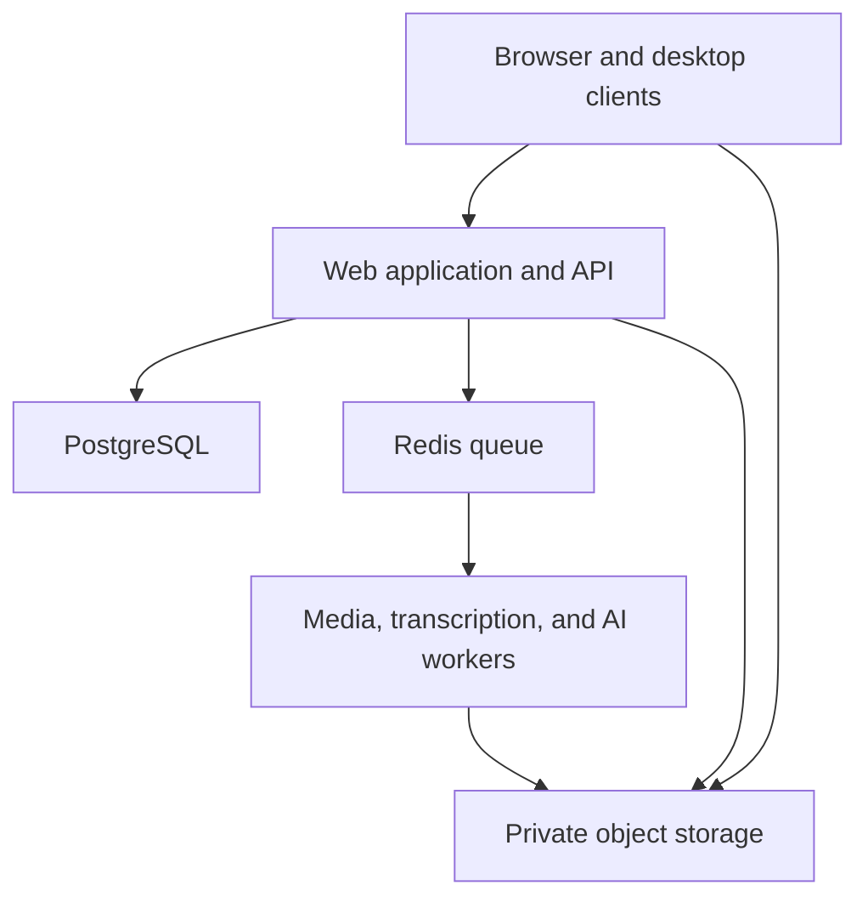
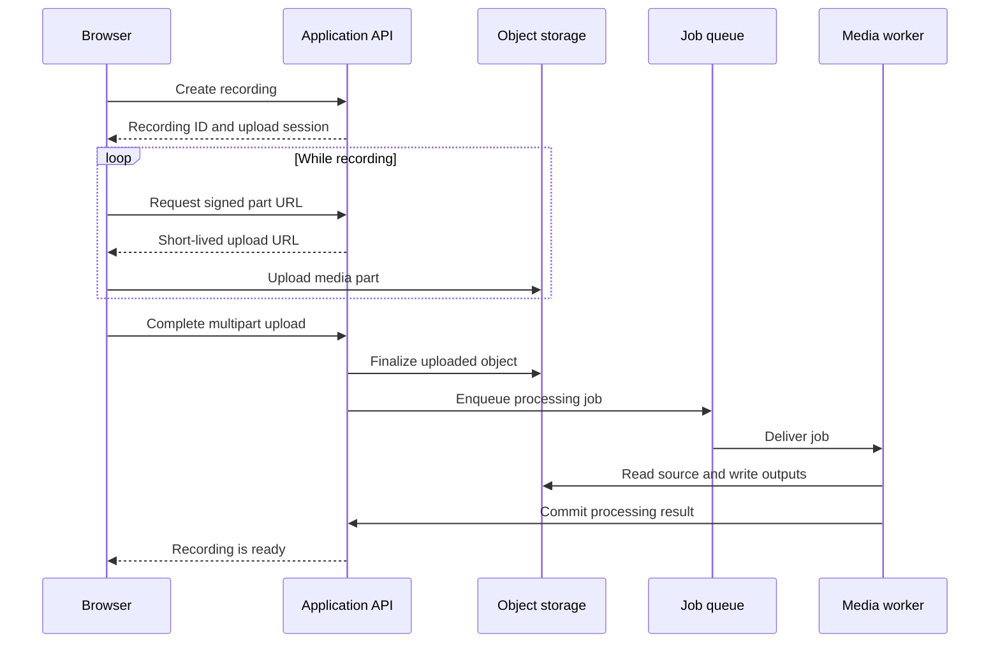
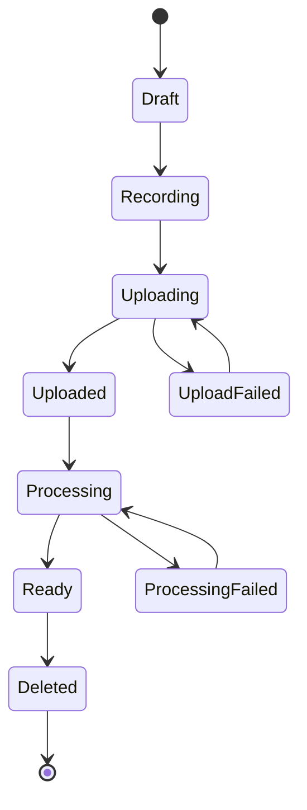

# Open-Source Screen Recording Platform Architecture

## 1. Purpose

This document defines the architecture for a greenfield, open-source screen-recording and video-sharing platform hosted with Coolify. The product is inspired by the general workflow of tools such as Loom, but it is an independent implementation with its own code, interface, data model, and identity.

The platform targets a comprehensive recording, editing, intelligence, collaboration, and publishing workflow:

> Capture in the browser or desktop application, edit non-destructively, transcribe and enrich with AI, publish securely, and collaborate through a controlled share experience.

Delivery remains phased so each subsystem can be tested and operated safely, but advanced editing, AI features, transcription, and native desktop capture are committed parts of the complete build—not optional future ideas.

## 2. Architecture principles

1. **Large video files bypass the web server.** Clients upload directly to S3-compatible object storage with short-lived signed requests.
2. **Media processing is asynchronous.** FFmpeg runs in a dedicated worker, never inside a web request.
3. **The storage bucket is private by default.** The application authorizes access before issuing temporary playback URLs.
4. **Workspace isolation is enforced server-side.** Every workspace-owned record includes a `workspace_id`, and every operation checks membership and permissions.
5. **State transitions are explicit.** Recordings move through a controlled lifecycle rather than arbitrary status updates.
6. **Infrastructure is replaceable.** Storage, email, authentication providers, and telemetry are accessed through internal interfaces.
7. **Deployment is reproducible.** Production uses immutable, versioned container images instead of building an unpinned branch on the server.
8. **Start simple and scale by pressure.** Coolify and Docker services are sufficient initially; Kubernetes is not required.

## 3. Comprehensive product scope

### Included in the complete build

- Account creation and authentication
- Personal and team workspaces
- Browser screen recording
- Microphone capture
- Optional camera stream
- Native desktop recording for Windows, macOS, and Linux
- Reliable system-audio capture
- Offline recording with resumable background upload
- Resumable multipart uploads
- Video processing and thumbnail generation
- Adaptive streaming renditions
- Non-destructive timeline editing
- Trimming, splitting, cropping, and clip reordering
- Zoom, pan, background, layout, and camera-overlay effects
- Text, callout, blur, shape, and image overlays
- Audio gain, muting, replacement, and noise reduction
- Captions and searchable transcripts
- Transcript correction and speaker labeling
- AI-generated titles, summaries, chapters, action items, and highlights
- Semantic search across recordings and transcripts
- Translation and subtitle export
- Private, unlisted, password-protected, and public sharing
- Shareable playback pages
- Timestamped comments
- Basic view analytics
- Embeddable playback
- Configurable retention
- S3-compatible object storage
- Coolify deployment
- Webhooks, REST API, and integrations
- Administrative controls, audit logs, and retention policies

### Outside the committed build

- Live streaming
- Multi-region deployment
- Real-time multi-user timeline editing
- Digital-rights-management systems

## 4. Technology choices

| Concern | Choice |
| --- | --- |
| Repository | pnpm workspace with Turborepo |
| Language | TypeScript in strict mode |
| Web application | Next.js |
| API | Next.js route handlers with a domain service layer |
| UI | React, Tailwind CSS, accessible headless components |
| Database | PostgreSQL |
| Database access | Drizzle ORM and versioned SQL migrations |
| Validation | Zod at every external boundary |
| Queue | BullMQ |
| Queue backend | Redis |
| Media processing | Dedicated FFmpeg worker |
| Desktop application | Tauri with a Rust capture and media core |
| Editor | React timeline UI with a versioned edit-decision model |
| Transcription | Provider-neutral speech-to-text adapter with self-hosted option |
| AI orchestration | Dedicated asynchronous AI worker with provider adapters |
| Search | PostgreSQL full-text search initially; vector search behind an adapter |
| Object storage | Private AWS S3 bucket with SSE-KMS; adapter retained for local testing |
| Playback | Native HTML5 video with HLS support |
| Unit tests | Vitest |
| End-to-end tests | Playwright |
| Containers | Multi-stage Docker builds |
| Deployment | Coolify |
| Container registry | GitHub Container Registry |

Exact dependency versions are pinned in the lockfile and updated through reviewed pull requests.

## 5. System context



The web application is the control plane. It manages identity, authorization, metadata, upload sessions, share links, and signed media access. Object storage and the media worker form the data plane for large files.

## 6. Deployable services

### Web

Responsibilities:

- Render the dashboard and share pages
- Authenticate users
- Enforce workspace permissions
- Create recordings and multipart upload sessions
- Sign upload requests
- Complete uploads
- Enqueue processing jobs
- Issue short-lived playback access
- Receive comments and analytics events

The web container must not process videos or proxy full video uploads.

### Worker

Responsibilities:

- Consume processing jobs from Redis
- Validate source media
- Inspect codec, dimensions, duration, and frame rate
- Produce playback assets
- Generate poster images and thumbnails
- Clean temporary files
- Update processing results safely

Worker jobs must be idempotent. Retrying the same job must not create conflicting assets or corrupt recording state.

Production uses separate worker processes and queues for media, transcription, and AI workloads. They may share package code, but they scale and fail independently because their CPU, memory, network, and provider dependencies differ.

### PostgreSQL

PostgreSQL stores application metadata only. Video bytes, thumbnails, and playback segments belong in object storage.

### Redis

Redis supports queues, short-lived coordination, and rate limiting. PostgreSQL remains the source of truth; losing Redis must not lose a completed recording or its metadata.

### Object storage

The bucket stores:

```text
workspaces/{workspaceId}/recordings/{recordingId}/source/...
workspaces/{workspaceId}/recordings/{recordingId}/playback/...
workspaces/{workspaceId}/recordings/{recordingId}/thumbnails/...
```

Object keys use internal identifiers, not user-provided filenames. Credentials are scoped to the required bucket and operations.

Production uses a separate private AWS S3 bucket and customer-managed KMS key per
environment. S3 Block Public Access and bucket-owner-enforced object ownership are
mandatory. Browser uploads use short-lived multipart presigned requests; HLS
delivery uses CloudFront with Origin Access Control and path-scoped signed cookies.
AWS SDK types remain inside the storage adapter so local tests can use an
S3-compatible emulator without leaking provider details into domain code.

## 7. Recording and upload flow



### Browser capture

The browser uses:

- `getDisplayMedia()` for screen capture
- `getUserMedia()` for microphone and camera
- `MediaRecorder` for encoded chunks
- IndexedDB for local upload state and recovery metadata

Recording chunks should normally cover several seconds. Very small chunks create excessive storage requests; very large chunks increase retry cost.

### Resumability

The browser retains the following locally until the upload completes:

- Recording ID
- Multipart upload ID
- Uploaded part numbers
- Storage ETags
- Pending chunks
- Retry state

Temporary network loss must pause uploads without stopping capture where the browser has enough local capacity. Retry uses capped exponential backoff with jitter.

### Upload security

- Signed URLs expire quickly.
- The API controls the bucket, object key, method, and permitted content size.
- CORS permits only approved application origins.
- Upload completion verifies expected ownership and upload session state.
- Abandoned multipart uploads are removed by a scheduled cleanup task.

## 8. Media-processing pipeline

The media pipeline performs:

1. Source validation
2. Media metadata extraction
3. Audio normalization when required
4. MP4 fallback generation
5. HLS playback generation
6. Poster generation
7. Preview-thumbnail generation
8. Database commit
9. Temporary-file cleanup

The complete pipeline supports adaptive playback renditions. Initial deployments may enable a smaller rendition set through configuration, but the processing manifest and player are designed for multiple resolutions and bitrates.

Each processing attempt records:

- Processing version
- Attempt number
- Start and completion time
- Worker identifier
- Source metadata
- Generated asset manifest
- Failure category

Temporary processing files use an isolated directory with a strict size limit and are removed on success, failure, and worker startup recovery.

## 9. Advanced non-destructive editor

The editor never rewrites source media during normal editing. It stores a versioned edit-decision document and renders previews from the source plus that document. Exporting creates a new immutable output asset.

### Editing capabilities

- Trim, split, delete, duplicate, and reorder clips
- Crop, rotate, resize, and change aspect ratio
- Keyframed zoom and pan
- Cursor emphasis and click visualization
- Camera position, shape, size, and visibility changes
- Background colors, gradients, images, padding, shadows, and rounded corners
- Text, image, shape, arrow, callout, and blur overlays
- Audio gain, mute regions, fades, replacement tracks, and noise reduction
- Caption styling and burned-in subtitle export
- Intro, outro, and reusable workspace templates
- Undo, redo, autosave, and named project versions

### Edit-decision model

Each project version contains:

```text
schema_version
recording_id
source_asset_ids
timeline_tracks
clips
transforms
effects
overlays
caption_style
audio_automation
canvas_settings
created_by
created_at
```

The schema is validated and migrated like application data. Commands produce reversible operations for undo and redo. Autosave writes new project revisions using optimistic concurrency so two stale editor sessions cannot silently overwrite each other.

### Preview and export

The browser uses lightweight preview proxies rather than original high-bitrate sources. Where supported, WebCodecs may accelerate local preview, but correctness cannot depend on it. Final export is a queued server job executed by an isolated render worker using FFmpeg and a deterministic render manifest.

## 10. Transcription and captions

Transcription is asynchronous and provider-neutral. A workspace can use a hosted speech-to-text provider or an approved self-hosted engine without changing recording-domain code.

The pipeline performs:

1. Extract and normalize an audio proxy.
2. Detect language or use the selected language.
3. Transcribe with word-level timestamps.
4. Optionally identify speakers.
5. Segment readable captions.
6. Store provider output separately from user corrections.
7. Index the approved transcript for search.
8. Generate WebVTT and SRT exports.

Transcript edits use stable segment and word identifiers. Reprocessing must not silently destroy manual corrections. Provider confidence, model identifier, language, processing cost, and consent-related metadata are retained for audit and debugging.

## 11. AI intelligence layer

AI features operate on approved transcript text and authorized metadata, not unrestricted bucket access. The AI worker receives the minimum data required for a job.

Supported capabilities:

- Suggested title and description
- Concise and detailed summaries
- Clickable chapters with timestamps
- Action items and decisions
- Key moments and short highlight suggestions
- Searchable questions and answers grounded in a recording
- Workspace semantic search
- Translation assistance
- Draft follow-up messages and documentation
- Sensitive-data detection suggestions before sharing

Every generated result records its input version, prompt-template version, provider, model identifier, output, timestamps, and status. AI output is treated as a suggestion until accepted where correctness matters.

Provider adapters enforce timeouts, retry policy, quotas, and redacted logs. Workspaces can disable AI, select allowed providers, and configure whether data may leave the deployment. A self-hosted inference adapter can be introduced without changing domain services.

## 12. Native desktop capture

The desktop application uses Tauri for the shell and a Rust media core for native capture, encoding, local project storage, and upload coordination.

Desktop responsibilities:

- Screen, window, region, camera, microphone, and system-audio capture
- Multi-monitor selection
- Configurable resolution, frame rate, and quality
- Global shortcuts and recording controls
- Cursor and click-event metadata
- Offline recording
- Crash-safe local recording manifests
- Local preview and editing
- Background resumable upload
- Automatic updates with signed releases
- Secure operating-system credential storage

The desktop app never embeds permanent object-storage credentials. It authenticates with the platform and requests short-lived upload authorization. Local projects remain usable if the server is temporarily unavailable.

Platform capture implementations live behind Rust traits so Windows, macOS, and Linux backends can differ without leaking platform-specific behaviour into the interface layer. Hardware encoding is optional and falls back safely to software encoding.

Desktop releases require code signing, update-signature verification, reproducible build documentation, and platform-specific capture-permission guidance.

## 13. Recording state machine



Allowed database transitions are implemented in one domain service. API routes, queue handlers, and user-interface code may request a transition but may not update recording status directly.

## 14. Data model

Core tables:

- `users`
- `accounts`
- `sessions`
- `workspaces`
- `workspace_members`
- `recordings`
- `recording_assets`
- `upload_sessions`
- `processing_attempts`
- `editor_projects`
- `editor_revisions`
- `render_jobs`
- `transcripts`
- `transcript_segments`
- `caption_tracks`
- `ai_jobs`
- `ai_artifacts`
- `search_documents`
- `desktop_devices`
- `share_links`
- `comments`
- `view_sessions`
- `audit_events`
- `webhooks`
- `retention_policies`

### Recording

Important columns:

```text
id
workspace_id
owner_id
title
status
visibility
source_object_key
duration_ms
width
height
processing_version
created_at
updated_at
deleted_at
```

Signed URLs are never stored because they expire. The database stores stable object keys and generates access URLs when requested.

### Multi-tenancy

Every workspace-owned table includes `workspace_id`. Repository methods require an explicit workspace scope, preventing accidental cross-workspace queries.

Database indexes should include common access paths such as:

- `(workspace_id, created_at)`
- `(workspace_id, status)`
- `(recording_id, created_at)` for comments and analytics
- Unique share-link token hashes

## 15. Authentication and authorization

Initial authentication supports email magic links and optional OAuth. Production email delivery is mandatory; authentication links must never be exposed through application logs.

Workspace roles:

| Role | Capabilities |
| --- | --- |
| Owner | Full workspace control, ownership transfer, and deletion |
| Admin | Member and recording administration |
| Member | Create and manage permitted recordings |
| Viewer | View permitted internal recordings |

Authorization is enforced in domain services. Interface visibility is a convenience, not a security boundary.

## 16. Sharing and playback

Supported visibility modes:

- `PRIVATE`: authenticated and authorized workspace members
- `LINK`: anyone possessing a high-entropy unlisted link
- `PASSWORD`: unlisted link plus a password
- `PUBLIC`: explicitly discoverable content

Share passwords are stored using a modern password-hashing function. The bucket remains private. After authorization, the server issues short-lived access to playback assets.

Playback endpoints support range requests, seeking, correct content types, and caching rules that do not leak private assets.

## 17. Repository structure

```text
cap/
├── apps/
│   ├── web/
│   ├── desktop/
│   ├── media-worker/
│   ├── transcription-worker/
│   └── ai-worker/
├── packages/
│   ├── auth/
│   ├── database/
│   ├── editor-domain/
│   ├── ai/
│   ├── transcription/
│   ├── media/
│   ├── domain/
│   ├── email/
│   ├── observability/
│   ├── queue/
│   ├── storage/
│   ├── ui/
│   └── validation/
├── infra/
│   ├── coolify/
│   └── docker/
├── docs/
│   ├── ARCHITECTURE.md
│   ├── DEPLOYMENT.md
│   ├── OPERATIONS.md
│   └── SECURITY.md
├── tests/
│   └── e2e/
├── docker-compose.local.yml
├── pnpm-workspace.yaml
├── turbo.json
└── package.json
```

Packages expose narrow public APIs. Applications must not import another package's internal files.

## 18. Coding standards

### Boundaries

- Route handlers validate input, authenticate, call a use case, and map the result to HTTP.
- Domain services contain business rules.
- Repositories contain database queries.
- Provider adapters contain S3, email, OAuth, and telemetry implementation details.
- React components do not call the database directly.
- Queue workers call the same domain services used by HTTP flows.
- Editor commands are deterministic and independently testable.
- AI and transcription providers implement internal interfaces and never leak provider response types into the domain.
- Rust capture backends implement platform-neutral traits.

### TypeScript

- Enable strict compiler settings.
- Avoid `any`; validate `unknown` at boundaries.
- Model domain states with discriminated unions.
- Use branded identifiers where they prevent entity-ID mixups.
- Return typed domain errors rather than parsing exception messages.
- Pass dependencies explicitly to services.

### Database

- All schema changes use reviewed migrations.
- Migrations are backward-compatible during rolling deployment.
- Money, timestamps, and durations use explicit database representations.
- Destructive migrations require a documented rollback or migration strategy.
- Transactions protect multi-step state changes.

### API

- Use consistent error envelopes.
- Require idempotency keys for retryable mutations such as upload completion.
- Paginate collections with stable cursors.
- Apply per-user and per-IP rate limits.
- Version external APIs before public release.

## 19. Coolify deployment

Create separate Coolify environments for staging and production.

### Production resources

| Resource | Publicly exposed | Persistent |
| --- | --- | --- |
| Web | Yes, through HTTPS | No |
| Media worker | No | No |
| Render worker | No | No |
| Transcription worker | No | No |
| AI worker | No | No |
| PostgreSQL | No | Yes |
| Redis | No | Yes where required by queue policy |
| Object storage | Through signed access only | Yes |

Workers have no public domains. PostgreSQL and Redis remain on private service networks. CPU-heavy media and render workers can be moved to a separate Coolify server without changing application contracts.

### Container rules

- Use non-root users.
- Use multi-stage builds.
- Copy only production artifacts into runtime images.
- Define health checks.
- Set CPU and memory limits.
- Set restart policies.
- Use read-only root filesystems where practical.
- Drop unnecessary Linux capabilities.
- Rotate container logs.
- Never bake secrets into images.

### Release process

1. Run formatting, linting, type checks, tests, and migration validation.
2. Build immutable web and worker images and signed desktop artifacts.
3. Tag images with the Git commit and release version.
4. Scan dependencies and images.
5. Deploy to staging.
6. Run recording, upload, processing, editing, transcription, AI, export, and playback smoke tests.
7. Approve production deployment.
8. Deploy the identical images to production.
9. Run post-deployment health checks.
10. Retain the prior release for rollback.

Database migrations run as a controlled release task, not independently from every web replica.

## 20. Observability

Every request and job carries a correlation ID. Logs use structured JSON and must not contain credentials, magic links, signed media URLs, share passwords, or recording contents.

Monitor:

- Web availability and latency
- Authentication failures
- Upload initiation and completion rates
- Abandoned uploads
- Queue depth and job age
- Processing duration and failures
- Render duration, queue age, and export failures
- Transcription latency, accuracy-review signals, and provider errors
- AI job latency, token or compute usage, rejection rate, and provider errors
- Desktop version adoption, crash reports, and upload recovery
- Worker CPU, memory, and temporary disk
- PostgreSQL health and connection use
- Redis health
- Object-storage errors and growth
- Backup age and restore-test status

Alerts should describe user impact and provide a runbook link.

## 21. Backup and recovery

### PostgreSQL

- Automated encrypted backups
- Daily, weekly, and monthly retention tiers
- Storage outside the application server
- Regular integrity verification
- Scheduled restoration exercises

### Object storage

- Explicit retention policy
- Delayed permanent deletion where business requirements allow
- Lifecycle cleanup for abandoned uploads and expired temporary assets
- Recovery strategy documented separately from cost-control lifecycle rules

### Recovery objectives

Recovery point and recovery time objectives must be agreed before production launch. A backup is not accepted until the team has restored it into an isolated environment and verified application behaviour.

## 22. Security baseline

- Private object-storage bucket
- Least-privilege service credentials
- Exact CORS origins
- Short-lived signed requests
- Secure, HTTP-only session cookies
- CSRF protection for cookie-authenticated mutations
- Content Security Policy
- Input validation at all trust boundaries
- File type, size, and duration limits
- Rate limits on authentication, sharing, comments, and uploads
- Password hashing for protected shares
- Audit events for sensitive workspace actions
- Secret rotation procedure
- Dependency and container scanning
- Coordinated vulnerability disclosure through `SECURITY.md`
- Signed desktop builds and signed automatic updates
- Provider-specific AI and transcription data controls
- Prompt-injection resistance for transcript-derived AI actions
- Human confirmation before AI-triggered external actions
- Automatic redaction of secrets and signed URLs from telemetry

User-provided titles and comments are treated as untrusted content and safely escaped when rendered.

## 23. Testing strategy

### Unit tests

- Recording state transitions
- Authorization policies
- Retention decisions
- Storage-key generation
- Share-link validation
- Editor command and undo/redo behaviour
- Transcript correction preservation
- AI artifact provenance and authorization
- Desktop upload-recovery state

### Integration tests

- PostgreSQL repositories
- Multipart upload lifecycle against local S3-compatible storage
- Queue retry and idempotency
- FFmpeg output validation
- Deterministic editor export manifests
- Transcription adapter contract tests
- AI provider adapter contract tests
- Desktop-to-server protocol compatibility
- Authentication callbacks

### End-to-end tests

- Record and upload a sample
- Resume an interrupted upload
- Process and play a recording
- Seek within playback
- Enforce private access
- Open an unlisted link
- Validate password protection
- Add a timestamped comment
- Edit and export a multi-track project
- Transcribe, correct, and search a recording
- Generate and accept AI chapters and summary
- Record offline in the desktop app and resume upload
- Delete and recover according to policy

### Failure tests

- Browser refresh during upload
- Temporary network loss
- Duplicate completion request
- Duplicate queue delivery
- Worker termination
- FFmpeg timeout
- Unsupported input
- Render worker interruption
- Transcription provider timeout
- AI provider rate limit or malformed output
- Desktop crash during recording and upload
- Storage outage
- Database restart
- Deployment rollback

## 24. Delivery roadmap

### Milestone 1: Capture prototype

- Screen and microphone recording
- Local playback
- Browser compatibility investigation

### Milestone 2: Reliable upload

- Recording metadata
- Multipart uploads
- IndexedDB recovery
- Retry and cleanup behaviour

### Milestone 3: Processing and sharing

- Redis queue
- FFmpeg worker
- Playback assets
- Thumbnail generation
- Share page

### Milestone 4: Accounts and teams

- Authentication
- Workspaces
- Membership and roles
- Private recordings

### Milestone 5: Collaboration

- Comments
- Reactions
- Embeds
- Basic analytics

### Milestone 6: Production readiness

- Coolify deployment
- Monitoring
- Backups
- Restore test
- Security review
- Load and failure testing

### Milestone 7: Transcription and captions

- Word-level transcription
- Transcript correction
- Speaker labels
- Search indexing
- WebVTT and SRT export

### Milestone 8: Advanced editor

- Versioned edit-decision model
- Multi-track timeline
- Visual and audio effects
- Autosave and revision history
- Preview proxies
- Deterministic server export

### Milestone 9: AI intelligence

- Titles, summaries, chapters, and action items
- Recording-grounded questions and answers
- Semantic workspace search
- Provider governance and usage controls
- Optional self-hosted inference adapter

### Milestone 10: Desktop application

- Tauri shell and Rust capture core
- Windows, macOS, and Linux capture backends
- System audio and global shortcuts
- Crash-safe offline recording
- Local editing and background uploads
- Signed installation and update pipeline

### Milestone 11: Comprehensive integration and launch

- Cross-feature authorization review
- Browser and desktop compatibility matrix
- Full editing, transcription, AI, and export acceptance suite
- Performance and cost testing
- Documentation, migration, operations, and incident runbooks
- Stable public API and webhook release

## 25. Decisions and non-goals

### Accepted decisions

- Browser-first release
- Complete browser and native desktop product target
- Modular monolith plus independent media worker
- Independent media, render, transcription, and AI worker queues
- Non-destructive, versioned editor architecture
- Provider-neutral transcription and AI adapters
- PostgreSQL as the source of truth
- Redis-backed asynchronous jobs
- Direct multipart uploads to private object storage
- Coolify-managed container deployment
- No Kubernetes initially

### Non-goals for the complete build

- Copying another product's interface or code
- Real-time collaborative editing
- Multi-region active-active infrastructure
- Premature service decomposition
- Live broadcasting and webinar hosting
- Copying another product's branding, assets, or interaction design

## 26. Definition of production-ready

The comprehensive platform is ready for general availability only when:

- A real recording can be captured, resumed, processed, shared, and played.
- Authorization tests prove workspace and private-link isolation.
- Failed jobs retry without corrupting state.
- The server can restart without losing committed data.
- Database restoration has been completed successfully.
- The previous application release can be restored.
- Secrets are absent from the repository and container images.
- Monitoring covers the main user journey.
- Browser and desktop recordings survive interruption and resume correctly.
- Editor revisions, previews, and final exports remain deterministic.
- Transcription preserves manual corrections across reprocessing.
- AI outputs are authorized, attributable, configurable, and auditable.
- Desktop installers and automatic updates are signed and verified.
- Editing, transcription, AI, and rendering workloads are isolated and independently scalable.
- Operating and incident runbooks exist.
- Staging and production use separate databases, buckets, credentials, and domains.

---

This document is the architectural baseline. Material changes should be recorded as architecture decision records in `docs/decisions/` before implementation.
